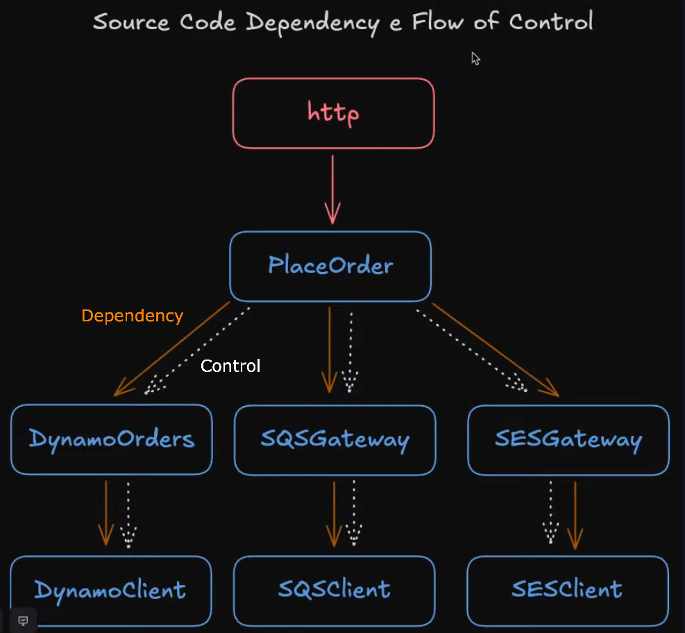
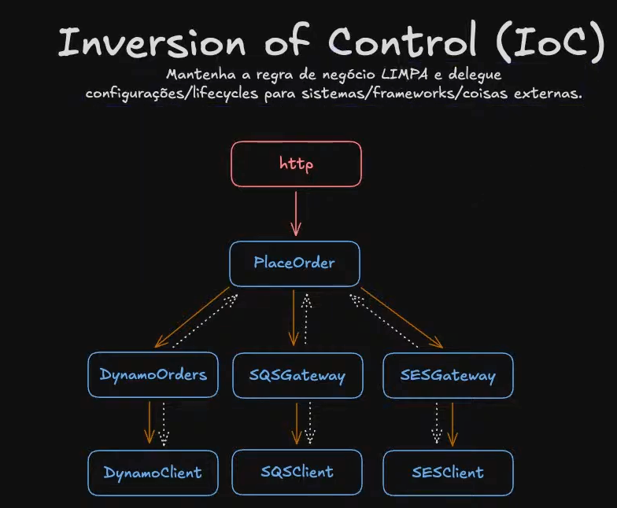
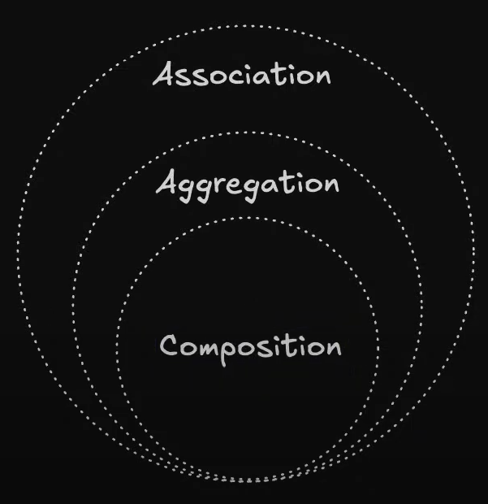
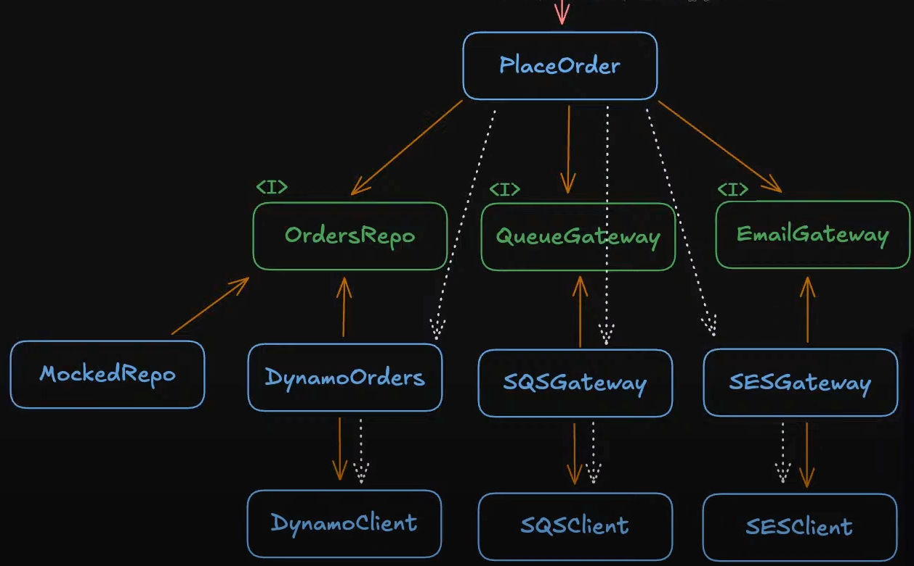
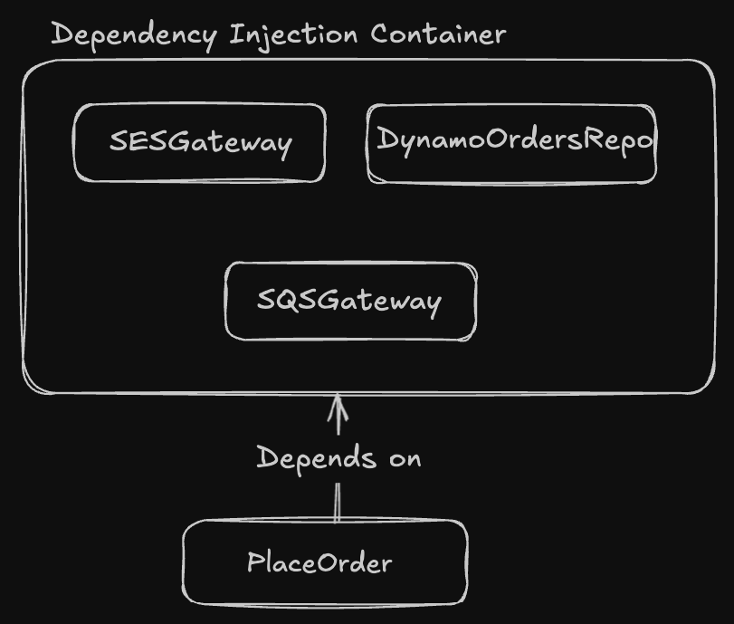

# Inversion of Control, Dependency Injection e Dependency Inversion

usecase vs services (to-do: melhorar essa escrita)

- usecase: sempre vai ter uma responsabilidade única (ex: um usecase que só faz executa a finalização de um pedido); o método dentro dele vai chamar `execute`, utiliza o Single Responsability Principle.
- services: pode ter mais de uma responsabilidade (ex: um service que faz a finalização do pedido, envia um email, lista as orders); o método dentro dele pode ser `placeOrder`, `sendOrderMail`, `listOrders`, etc; a desvantagem é que a classe pode ficar muito grande, com muitos métodos e muitas responsabilidades; um service também pode ser uma classe que interage com serviços externos, por exemplo um provedor de pagamentos para interagir com a api.

## Source Code Dependency e Flow of Control

### Source Code Dependency

É a direção em que as dependências do código vão:
-> http (fastify)
-> PlaceOrderUseCase
-> DynamoDBOrderRepository
-> DynamoClient
-> SQSGateway
-> SQSClient
-> SESGateway
-> SESClient

### Flow of Control

Fluxo de controle da execução do código, ou seja, a ordem em que as funções são chamadas em runtime. No exemplo acima, o fluxo de controle é o mesmo do soruce code dependency, ou seja, o Flow of Control está na mesma direção que Source Code Dependency, conforme também ilustrado na imagem abaixo.

## Inversion of Control (IoC)

Ao invés do usecase instanciar as suas dependências, ele apenas recebe as dependências como parâmetros. O IoC é uma técnica que permite inverter o controle de execução de um sistema, ou seja, o controle é passado para um framework ou container que vai instanciar as dependências e passar para o usecase. O usecase ainda executa as dependências, mas não sabe de onde vem as dependências, ele só sabe que elas vão ser passadas para ele.
Podemos usar o princípio de Hollywood como exemplo: "Don't call us, we'll call you"

### Dependency Injection (DI)

É um design pattern que permite injetar as dependências de uma classe em tempo de execução. O objetivo é desacoplar as dependências de uma classe, permitindo que elas sejam substituídas por outras dependências em tempo de execução. O uso de DI permite que as dependências sejam passadas para a classe que as utiliza, ao invés de serem instanciadas dentro da classe. Podemos dizer que é uma maneira de inverter o Flow of Control.

Em programação orientada a objeto, os relacionamentos entre classes executam um papel crucial na definição de como os objetos interagem uns com os outros. Existem alguns mecanismos para modelar esses relacionamentos como association, aggregation e composition.

**Composition**: o ciclo de vida de um objeto nasce (é instanciado) e morre (é destruído) dentro de um contexto, ou seja, se o objeto pai não existir, o objeto filho também não existirá. Por exemplo: ao instanciar um objeto do tipo `Order` dentro do usecase `PlaceOrder`, estamos dizendo que o objeto `Order` só existe dentro do contexto do usecase `PlaceOrder`.

**Aggregation**: o ciclo de vida de um objeto não depende do objeto pai, ou seja, se o objeto pai for destruído, o objeto filho ainda pode existir. Por exemplo: ao receber as dependências `DynamoDBOrderRepository`, `SQSGateway` e `SESGateway` no construtor do usecase `PlaceOrder`, estamos dizendo que essas dependências podem existir fora do contexto do usecase `PlaceOrder`, ou seja, podemos ter um `DynamoDBOrderRepository` sem um `PlaceOrder`, podemos usar o `DynamoDBOrderRepository` em outro lugar.

**Association**: é o relacionamento "has-a" (tem um), ou seja, o usecase `PlaceOrder` tem uma associação com o `DynamoDBOrderRepository`, tem um `DynamoDBOrderRepository`, indepdente se ele foi criado como uma composição ou se foi injetado como uma agregação.

## Dependency Inversion Principle (DIP)

"High-level modules should not depend on low-level modules. Both should depend on abstractions. Abstractions should not depend on details. Details should depend on abstractions."

High-level modules -> regras de negócio, código mais "puro", o código mais alto nível da aplicação, que não depende de detalhes de implementação. Exemplo: para fazer uma order, é necessário inserir no banco de dados, enviar um email, etc, mas não importa como essas ações são executadas. O high-level module seria o usecase `PlaceOrder`.
Low-level modules -> detalhes de implementação, como o banco de dados, envio de email, etc. Exemplo: `DynamoDBOrderRepository`, `SQSGateway`, `SESGateway`.

## Factory Pattern

É um padrão de design que permite criar instâncias de objetos sem especificar a classe exata do objeto que será criado. O Factory Pattern define uma interface para criar objetos, mas deixa a implementação da criação de objetos para as classes filhas. O Factory Pattern é usado quando queremos criar um objeto sem expor a lógica de criação do objeto para o cliente.

## Dependency Injection Container

É onde vamos registrar todas as classes que queremos que sejam injetáveis, ou seja, que podem ser usadas em outros lugares. No nosso exemplo, o usecase `PlaceOrder` dependerá apenas do Dependency Injection Container (DIContainer), onde ele irá utilizar as dependências que foram registradas no DIContainer da maneira que for necessária. Nesse cenário, continuamos a usar a injeção de dependência, porém mudamos a estratégia que, ao invés de ser em um construtor, passamos a utilizar o container para fazermos as injeções. Um framework que faz isso é o NestJS. Um pattern que podemos usar para fazer isso é o **Registry**.

## Reflect

É um objeto nativo do Javascript que é útil para manipular objetos, como por exemplo, validar se um objeto tem determinada(s) propriedade(s), recuperar as chaves de um objeto, setar uma propriedade em um objeto, etc.
[Ref - Reflect](https://developer.mozilla.org/en-US/docs/Web/JavaScript/Reference/Global_Objects/Reflect)
[Ref - Reflect Metadata](https://www.npmjs.com/package/reflect-metadata)

Uso do Reflact para registrar as dependências no DIContainer e também fazer a inversão de dependência. O código fica no Registry e é necessário registrar as dependências no DIContainer (`src/di/container.ts`).

## Ferramentas que cuidam da injeção de dependência

[typescript-ioc](https://www.npmjs.com/package/typescript-ioc)
[typedi](https://www.npmjs.com/package/typedi)
[InversifyJS](https://github.com/inversify/InversifyJS)
[tsyringe](https://www.npmjs.com/package/tsyringe/v/2.1.1) <- mais famoso
